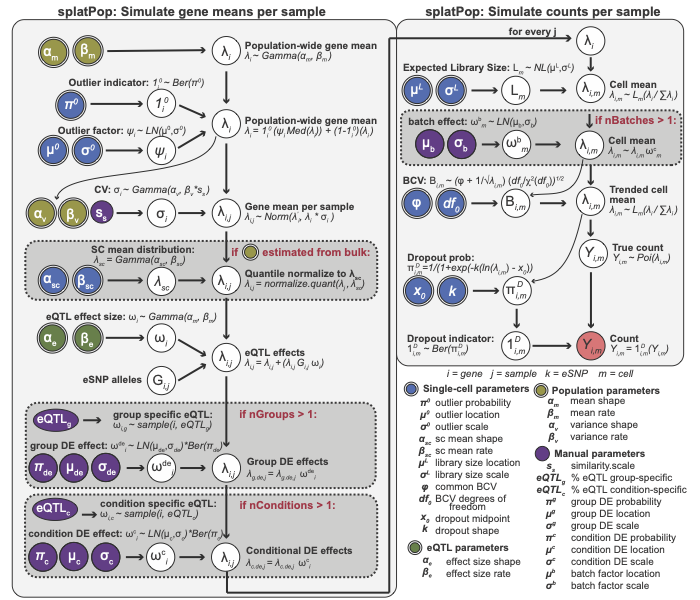

```{r knitr-options, include = FALSE}
knitr::opts_chunk$set(collapse = TRUE, comment = "#>")
```

```{r setup}
suppressPackageStartupMessages({
  library("splatter")
  library("scater")
  library("VariantAnnotation")
  library("ggplot2")
})
set.seed(42)
```


# Introduction

splatPop is an extension of the splat model that allows you to simulate single-cell RNA-sequencing count data for a population. Like with splat, these simulations resemble real scRNA-seq data because they use parameters estimated from empirical data. Provided with genotype information (VCF) for a population as input, splatPop simulates gene counts for multiple cells for all individuals in the population. The vcf information is used to achieve realistic population structure in the simulated data by modeling expression Quantitative Trait Loci (eQTL) effects, where the expression of a gene is associated with the genotype of the individual at a specific loci. Finally, splatPop allows for the simulation of complex data sets including:

  1. **Cell group effects:** Where multiple, heterogeneous cell-groups are simulated for each individual. These groups could represent different cell-types or the same cell-type before/after a treatment. Group effects include group-specific differential expression (DE) and/or group-specific expression Quantitative Trait Loci (eQTL) effects. 
  2. **Conditional effects between individuals:** Where individuals are simulated as belonging to different conditional cohorts (e.g. different treatment groups or groups with different disease statuses). Conditional effects include DE and/or eQTL effects. 
  3. **Batch effect from multiplexed experimental designs:** Like in splat, batch effects are simulated by assigning small batch-specific DE effects to all genes. splatPop allows for the simulation of different patterns of batch effects, such as those resulting from multiplexed sequencing designs. 


# Quick start

The primary simulation function is `splatPopSimulate`, which runs through the two main phases:

1. `splatPopSimulateMeans`: the simulation of means for all genes for all individuals in the population.
2. `splatPopSimulateSC`: the simulation of single-cell counts for all cells for all genes for all individuals. 

The second phase is essentially a wrapper around the original `splatSimulate` function, which is described in detail [here](splatter.html). The figure below describes these two phases. Input parameters that can be estimated from real data have double borders and are shaded by the type of data used. The final output (red) is a matrix of means for each gene and each individual that is used as input to the second phase. 



To get started with splatPop, you only need genotype information for the population you want to simulate provided as a [VariantAnnotation object](https://bioconductor.org/packages/release/bioc/html/VariantAnnotation.html). A mock VariantAnnotation object can be produced using the `mockVCF` function. Here we simulate single-cell RNA-sequencing counts for 100 random genes for 6 random samples:

```{r quick-start}
vcf <- mockVCF()
gff <- mockGFF()

sim <- splatPopSimulate(vcf = vcf, gff = gff, sparsify = FALSE) 
sim <- logNormCounts(sim)
sim <- runPCA(sim, ncomponents = 5)
plotPCA(sim, colour_by = "Sample")
```

# Detailed look into splatPop

## Step 1: Parameter Estimation 

The parameters used in splatPop have sensible default values estimated from GTEx data (v7, thyroid tissue). However, they can also be estimated from real data provided by the user using the `splatPopEstimate`. The gamma distributions describing the population-level gene mean and variance levels can be estimated from real population scale bulk or aggregated single-cell RNA-seq data. The gamma distribution describing eQTL effect sizes can be estimated from real eQTL mapping results. You can also provide this function with a SCE object or matrix of single-cell counts to estimate single-cell parameters described in splat.

All parameters needed for splatPop simulations are stored in a `SplatPopParams` object. In addition to the compartments in `SplatParams` described in detail in the [Splat parameters vignette](splat_params.html) and the parameters that are set manually (described below), `SplatPopParams` also contains the following parameters that can be estimated from real data: 

* **Population parameters**
    * `pop.mean.shape` - Shape parameter for mean expression from population scale data.
    * `pop.mean.rate` - Rate parameter for mean expression from population  scale data.
    * `pop.cv.param` - Shape and rate parameters for the coefficient of variation (cv) across individuals from the population scale data, binned by mean expression.
* **eQTL effect size parameters**
    * `eqtl.ES.shape` - Shape parameter for eQTL effect sizes.
    * `eqtl.ES.rate` - Rate parameter for eQTL effect sizes.


The parameters that can be estimated are in parentheses in the `SplatPopParms` object, while those that can't be estimated are in brackets. Those that have been changed from their default value (either by hand or by estimation) are in ALL CAPS.

For example, we can estimate new parameter values from user provided data...

```{r eqtlEstimate}
bulk.means <- mockBulkMatrix(n.genes=100, n.samples=100)
bulk.eqtl <- mockBulkeQTL(n.genes=100)
counts <- mockSCE()

params.est <- splatPopEstimate(means = bulk.means,
                               eqtl = bulk.eqtl,
                               counts = counts)
params.est
```

Note that `splatPopEstimate` will only estimate new parameters if the data required is provided. For example, if you want to simulate data using default gene means and eQTL parameters, but from single-cell parameters estimated from your own real single-cell counts data, you could run `splatPopEstimate` with only the `counts` argument provided.

## Step 2: Simulate gene means 

The `splatPopSimulate` function runs both phases of splatPop, however we can run these two phases separately to highlight their distinct functions. The first phase is run using `splatPopSimulateMeans`. 

### Input data

`splatPopSimulateMeans` requires two pieces of input data: genotypes and genes. Mock data can  be provided using `mockVCF` and `mockGFF`, respectively. These mock functions generate random SNP and gene annotation data for chromosome 22. 

To simulate populations with realistic population structure, real genotype data should be provided as a [VariantAnnotation object](https://bioconductor.org/packages/release/bioc/html/VariantAnnotation.html).

splatPop can be told what genes to simulate in three ways: 

1. **GFF/GTF (-gff data.frame):** Provide a GFF/GTF file as a `data.frame` object. splatPop will filter out all non-gene features (3rd column != gene). This method uses real gene names and locations, but will randomly assign expression values and eQTL effects to these genes. 
2. **Key (-key data.frame):** Provide a `data.frame` object including information about genes you want to simulate. At minimum, this object must include columns specifying the *geneID*, *chromosome*, and location (*geneMiddle*). With just those columns, splatPop will function the same as if a GFF was provided. However, you can also use this object to specify other information. If you provide a desired mean (*meanSampled*) and variance (*cvSampled*) for  each gene, splatPop will use these instead of randomly sampled values. If you provide eSNP information (*eSNP.ID* and *eQTL.EffectSize*) and the group effect information (*eQTL.group*, *GroupDE.GroupN*), splatPop will simulate gene means with these eQTL associations instead of generating eQTL associations and group effects randomly. Finally, if you provide conditional effect information (*eQTL.condition*, *ConditionDE.ConditionN*), splatPop will use those conditional effects instead of randomly assigning its own.
3. **Randomly (-gff NULL -key NULL):** This option will call `mockGFF` to generate a random GFF file for a specified chromosome. This is the default option if neither `gff` or `key` is provided.

Note that splatPop will assign eSNPs to genes within a defined window, thus the provided genotype and gene information needs to span the same genomic regions. 


### Control parameters

In addition to the parameters estimated from real data, the `SplatPopParams` object also includes control parameters that must be set by the user. In addition to the parameters described in detail in the [Splat parameters vignette](splat_params.html), the following `SplatPopParams` control parameters can be changed using `setParams`:

* **Population parameters** 
    * `similarity.scale` - Scaling factor for the population variance (cv) rate parameter. Increasing this scaling factor increases the similarity between individuals.
    * `pop.quant.norm` - Logical to run the quantile normalization function, which fits the distribution of gene means for each individual to the distribution estimated from the single-cell data, the  parameter can be set to FALSE.
    * `batch.size` - The number of samples to include in each batch (described in detail below)
    * `nCells.sample` - Logical indicating if the number of cells to simulate for each sample should be sampled from a gamma distribution.
    * `nCells.shape` - Gamma distribution shape parameter for the number of cells to simulate for each sample
    * `nCells.rate` - Gamma distribution rate parameter for the number of cells to simulate for each sample
    * `cv.bins` - The number of bins to include when estimating population scale variance parameters.
* **eQTL Parameters**
    * `eqtl.n` - Number (>1) or percent (<=1) of genes to assign with eQTL effects.
    * `eqtl.dist` - Maximum distance (bp) between the center of a gene and possible eSNPs for that gene.
    * `eqtl.maf.min` - Minimum Minor Allele Frequency (MAF) of eSNPs.
    * `eqtl.maf.max` - Maximum MAF of eSNPs.
    * `eqtl.group.specific` - Percent of eQTL effects to make group specific. The number of groups is specified using the "group.prob" parameter.
    * `eqtl.condition.specific` - Percent of eQTL effects to make condition specific. The number of conditions is specified using the `nConditions` or `condition.prob` parameters.
    * additional conditional effect parameters described below...
 * **Group specific parameters**   
    * `nGroups` - Number of groups to simulate for each individual. 
    * `group.prob` - Array of the proportion of cells that should be simulated
      in each group. 

In addition to the group specific eQTL effects, each group will have group specific differential expression effects, which are not associated with a genetic variant). These parameters are estimated from real single-cell data as described in [splatter](splatter.html).

### Output

The output of `splatPopSimulateMeans` is a list containing:

* `means` - a data.frame (or list of data.frames if `nGroups` > 1) with simulated mean gene expression value for each gene (row) and each sample (column).
* `key` - a data.frame listing for all simulated genes: the assigned mean and variance (before and after quantile normalization), the assigned eSNP and its effect size and type (global/group specific), and other group effects.

Note that when `splatPopSimulate` is run, these to objects are contained in the output SingleCellExperiment object (details below). Let's look at a snapshot of some simulated means and the corresponding key...

```{r splatPopSimulateMeans}
params <- newSplatPopParams()

sim.means <- splatPopSimulateMeans(vcf = vcf, gff = gff,
                                   params = params)

round(sim.means$means[1:5, 1:3], digits = 2)

print(sim.means$key[1:5, ], digits = 2)

print(sim.means$conditions)
```

### Other examples

**Replicate a simulation by providing a gene key** 

As described above, information about genes can also be provided in a data.frame using the `key` argument. If you provide `splatPopSimulateMeans` with the key output from a previous run, it will generate a new population with the same properties, essentially creating a replicate. Here is a snapshot of such a replicate using the key simulated above:

```{r splatPopSimulateMeans-from-key}
sim.means.rep2 <- splatPopSimulateMeans(vcf = vcf, key=sim.means$key,
                                        params = newSplatPopParams())

round(sim.means.rep2$means[1:5, 1:5], digits = 2)
```

**Estimating parameters from bulk expression data** 

An important step of `splatPopSimulate` is the quantile normalization of simulated gene means for each sample to match a gamma distribution estimated from real single-cell RNA-seq data using `splatEstimate` or `splatPopEstimate`. This step ensures that even if bulk sequencing data are used to estimate population parameters, the means output from `splatPopSimulateMeans` will be distributed like a single-cell dataset.

If you already have bulk expression data for a population, you can use this quantile normalization function directly on that data and use the output as input to `splatPopSimulateSC`. Note that this will not simulate eQTL or group effects, just simulate single-cell counts using the bulk means provided. 

```{r quant-normalize-population-data}
bulk.qnorm <- splatPopQuantNorm(newSplatPopParams(), bulk.means)
round(bulk.qnorm[1:5, 1:5], 3)
```

**Generate a population directly from empirical data**

The power of splatter, and splatPop by extension, comes from estimating important parameters from empirical data and then using the distributions defined by those parameters to generate realistic simulated data, maintaining the properties of the empirical data without directly replicating it. While this allows you to simulate datasets that differ from your empirical data (for example, with different numbers of genes or with different sized eQTL effects), there may be cases when you want to more exactly replicate an empirical dataset, for example if you want gene-gene relationships to be maintained. To run splatPop in this mode, provide `splatPopSimulate` or `splatPopSimulateMeans` with the vcf, gff, eQTL, and population-scale gene means data directly. This will overwrite the splatPop population and eqtl parameters and instead replicate the data provided. For example, provided with the following eQTL mapping data: 

```{r empirical-mock-data}
emp <- mockEmpiricalSet()
head(emp$eqtl[, c("geneID", "snpID", "snpCHR", "snpLOC", "snpMAF", "slope")])
```

the gene location information will be pulled from the GFF and the gene mean and variance information will be pulled from the population-scale gene mean data, to produce a splatPop key: 

```{r empirical-based-simulation}
emp.sim <- splatPopSimulateMeans(vcf = emp$vcf, gff = emp$gff, eqtl = emp$eqtl, 
                         means = emp$means, params = newSplatPopParams())
head(emp.sim$key)

```


## Step 3: Simulate single cell counts

Finally, single cell level data is simulated using `splatPopSimulateSC`. Running this function on its own requires the `SplatPopParams` object and the two outputs from `splatPopSimulateMeans`: the key and the simulated means matrix (or list of matrices if nGroups > 1). The user can also provide additional parameters for the single-cell simulation, for example how many cells to simulate. 

Looking at the output of `splatPopSimulateSC` we see that it is a single `SingleCellExperiment` object (SCE) with a row for each feature (gene) and a column for each cell. The simulated counts are accessed using `counts`, although it can also hold other expression measures such as FPKM or TPM. Information about each cell (e.g. sample, group, batch) is held in the `colData` and information about each gene (e.g. location, eQTL effects, and other data from the splatPop key) is held in the `rowData`. The `splatPopParams` object and the simulated gene means matrix/list of matrices is also saved as metadata in the SCE object.  

```{r eqtl-splatPopSimulateSC-simple-object}
sim.sc <- splatPopSimulateSC(params=params, 
                             key = sim.means$key,
                             sim.means=sim.means$means, 
                             batchCells=50, 
                             sparsify = FALSE)
sim.sc
```

We can visualize these simulations using plotting functions from **scater** like plotPCA...

```{r eqtl-splatPopSimulateSC-simple-plots}
sim.sc <- logNormCounts(sim.sc)
sim.sc <- runPCA(sim.sc, ncomponents = 10)
plotPCA(sim.sc, colour_by = "Sample")
```

Another useful feature of splatPop is the ability to simulate N cells per individual, where N is sampled from a gamma distribution provided by the user. 

```{r splatPop-simulation-nCells-sampled}
params.nCells <- newSplatPopParams(nCells.sample = TRUE,
                                   nCells.shape = 1.5,
                                   nCells.rate = 0.01)

sim.sc.nCells <- splatPopSimulate(vcf = vcf, gff = gff, params = params.nCells, 
                               sparsify = FALSE)

sim.sc.nCells <- logNormCounts(sim.sc.nCells)
sim.sc.nCells <- runPCA(sim.sc.nCells, ncomponents = 2)
plotPCA(sim.sc.nCells, colour_by = "Sample")
```

## Complex splatPop simulations

### Cell-group effects

The population simulated above is an example of a dataset with a single cell type across many samples. However, splatPop also allows you to simulate population-scale data for a mixture of cell-groups. These groups could represent different cell-types or could represent the same cell type before and after treatment. 

Two types of group effects are included: group-specific eQTL and group-specific differential expression (DE) effects. The number of groups to simulate is set using the *group.prob* parameter in `SplatPopParams`. The DE effects are  implemented as in the `splat` simulation, with the user able to control `splatPopParam` parameters including *de.prob*, *de.downProb*, *de.facLoc*, and *de.facScale*. For group-specific eQTL, the proportion of eQTL to designate as group-specific eQTL is set using *eqtl.group.specific*. 

When used to simulate single-cell data with group-specific effects, `splatSimulatePop`  also outputs:

* **Cell information (`colData`)**
    * `Group` - The group ID for each cell.

```{r group-specific-eQTL-simulations}
params.group <- newSplatPopParams(batchCells = 50,
                                  group.prob = c(0.5, 0.5))

sim.sc.gr2 <- splatPopSimulate(vcf = vcf, gff = gff, params = params.group, 
                               sparsify = FALSE)

sim.sc.gr2 <- logNormCounts(sim.sc.gr2)
sim.sc.gr2 <- runPCA(sim.sc.gr2, ncomponents = 10)
plotPCA(sim.sc.gr2, colour_by = "Group", shape_by = "Sample")
```

From the PCA plot above you can see that in this simulation the sample effect outweighs the group effect. But we can tune these parameters to change the  relative weight of these effects. First we can decrease the sample effect by increasing the *similarity.scale* parameter. And second we can increase the group effect by adjusting the *eqtl.group.specific* and *de* parameters: 

```{r group-specific-eQTL-simulations-bigger}
params.group <- newSplatPopParams(batchCells = 50,
                                  similarity.scale = 8,
                                  eqtl.group.specific = 0.6,
                                  de.prob = 0.5,
                                  de.facLoc = 0.5, 
                                  de.facScale = 0.5,
                                  group.prob = c(0.5, 0.5))

sim.sc.gr2 <- splatPopSimulate(vcf = vcf, gff = gff, params = params.group, 
                               sparsify = FALSE)

sim.sc.gr2 <- logNormCounts(sim.sc.gr2)
sim.sc.gr2 <- runPCA(sim.sc.gr2, ncomponents = 10)
plotPCA(sim.sc.gr2, colour_by = "Group", shape_by = "Sample")
```

### Conditional effects

Conditional effects are effects that are specific to a subset of the individuals being simulated. First, splatPop randomly assigns samples to cohorts, with the number of cohorts and proportion of individuals in each cohort specified using the *condition.prob* parameter. These cohorts can represent different treatment groups or groups with different disease statuses, where every sample is assigned to only one cohort.

Like with group effects, the two types of conditional effects are included: condition-specific eQTL and condition-specific differential expression (DE) effects. The DE effects are implemented as in the `splat` simulation, with the user able to control `splatPopParam` parameters including *cde.prob*, *cde.downProb*, *cde.facLoc*, and *cde.facScale*. For condition-specific eQTL, the proportion of eQTL to designate as condition-specific eQTL is set using *eqtl.condition.specific*. 

```{r simulate-population-with-condition-effects}
params.cond <- newSplatPopParams(eqtl.n = 0.5, 
                                 batchCells = 50,
                                 similarity.scale = 5,
                                 condition.prob = c(0.5, 0.5),
                                 eqtl.condition.specific = 0.5,
                                 cde.facLoc = 1, 
                                 cde.facScale = 1)

sim.pop.cond <- splatPopSimulate(vcf = vcf, gff = gff, params = params.cond, 
                                 sparsify = FALSE)

sim.pop.cond <- logNormCounts(sim.pop.cond)
sim.pop.cond <- runPCA(sim.pop.cond, ncomponents = 10)
plotPCA(sim.pop.cond, colour_by = "Condition", shape_by = "Sample", point_size=3)
```
In this example, the five samples are assigned to one of the two condition cohorts, and PCA 1 separates cells primarily by cohort. 

### Batch effects

Population-scale single-cell RNA-sequencing is typically achieved through multiplexing, where multiple samples are sequenced together in one batch and then separated computationally. Two parameters control how splatPop simulates data with batch structure: *batchCells* and *batch.size*. The *batchCells* parameter is a list containing the number of cells you want to simulate for each sample in each batch, where the length of the list is the total number of batches to simulate. The *batch.size* parameter controls how many samples are included in each batch. If (# batches) x (# samples per batch) is greater than the number of samples in the VCF file, splatPop will randomly assign some samples to >1 batch. Thus, by adjusting these two parameters you can design experiments where:

  - all samples are in one batch (batchCells=nCells, batch.size=nSamples)
  - all samples are present in multiple batches (batchCells=c(nCells, nCells), 
batch.size=nSamples)

In the following example, we request two batches (with 20 cells/sample in each) with 3 samples in each batch. Given the VCF file contains 5 samples, the simulated data will have one sample replicated in both batches. 

```{r simulate-population-with-batch-effects}
params.batches <- newSplatPopParams(similarity.scale = 4,
                                    batchCells = c(20, 20),
                                    batch.size = 3,
                                    batch.facLoc = 0.1,
                                    batch.facScale = 0.2)

sim.pop.batches <- splatPopSimulate(vcf = vcf, gff = gff, 
                                    params = params.batches, sparsify = FALSE)
sim.pop.batches <- logNormCounts(sim.pop.batches)
sim.pop.batches <- runPCA(sim.pop.batches, ncomponents = 10)
plotPCA(sim.pop.batches, colour_by = "Sample", shape_by = "Batch", point_size=3)
```

Different distributions can be used to sample batch effect sizes for different batches. For example, here we simulate three batches with 3 samples per batch and only 5 cells/sample/batch (for easy viewing), where batch 1 has a large batch effect compared to batches 2 and 3.

```{r simulate-population-with-different-sized-batch-effects}
params.batches <- newSplatPopParams(similarity.scale = 8,
                                    batchCells = c(5, 5, 5),
                                    batch.size = 3,
                                    batch.facLoc = c(0.5, 0.1,  0.1),
                                    batch.facScale = c(0.6, 0.15, 0.15))

sim.pop.batches <- splatPopSimulate(vcf = vcf, gff = gff, 
                                    params = params.batches, sparsify = FALSE)
sim.pop.batches <- logNormCounts(sim.pop.batches)
sim.pop.batches <- runPCA(sim.pop.batches, ncomponents = 10)
plotPCA(sim.pop.batches, colour_by = "Sample", shape_by = "Batch", point_size=3)
```

### Gene co-regulation

splatPop randomly selects an eSNP within the desired window for each eGene. By chance some eGenes may be assigned the same eSNP, but if many SNPs are provided this is rare. However, the `eqtl.coreg` parameter can be used to randomly select a percent of eGenes, sort them by chromosome and location, and assign them the same eSNP. This function maintains the randomly sampled effect sizes and designation as a global, group specific, and/or condition specific eQTL, however it does ensure that all eQTL with the same eSNP are given the same effect sign. Here, for example, we show the expression correlation between randomly paired genes in a splatPop simulation (grey) compared to expression correlation between co-regulated genes (blue), with the average correlation for each type designated by the large point.

```{r simulate-population-with-coregulation, fig.height=2}
params.coreg <- newSplatPopParams(eqtl.coreg = 0.4, eqtl.ES.rate=2)
vcf <- mockVCF(n.sample = 20, n.snps = 1200)
gff <- mockGFF(n.genes = 100)
sim.coreg <- splatPopSimulateMeans(vcf = vcf, gff = gff, params = params.coreg)
key <- sim.coreg$key
sim.cor <- cor(t(sim.coreg$means))
coregSNPs <- names(which(table(sim.coreg$key$eSNP.ID) == 2))

coregCorList <- c()
for(snp in coregSNPs){
  coregGenes <- row.names(sim.coreg$key)[which(sim.coreg$key$eSNP.ID == snp)]
  coregCorList <- c(coregCorList, sim.cor[coregGenes[1], coregGenes[2]])
}

randCorList <- c()
for (n in 1:1000){
  genes <- sample(row.names(sim.coreg$key), 2)
  randCorList <- c(randCorList, sim.cor[genes[1], genes[2]])
}

cor.df <- as.data.frame(list(type=c(rep("coregulated pairs", length(coregCorList)),
                                    rep("random pairs", length(randCorList))), 
                             correlation=c(coregCorList, randCorList),
                             id = "x"))

ggplot(cor.df, aes(x = correlation, y = id, color = type, alpha = type)) +  
  geom_jitter(size = 2, width = 0.1) +
  scale_alpha_discrete(range = c(0.6, 0.1)) + 
  stat_summary(fun = mean, geom = "pointrange", size = 1, alpha=1) + theme_minimal() +
  theme(axis.title.y=element_blank(), axis.text.y=element_blank(), 
        legend.position="top") + xlim(c(-1, 1)) +
  scale_color_manual(values=c("#56B4E9", "#999999"))
  

```


```{r sessionInfo}
sessionInfo()
```

